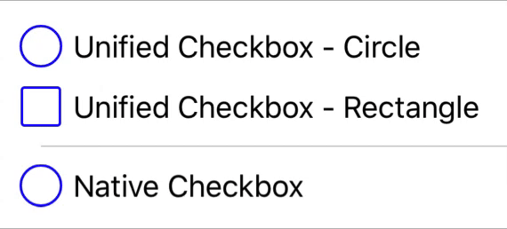
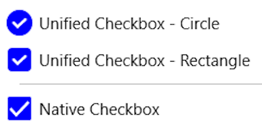

# Xamarin Controls


Cross-platform controls for Xamarin and Xamarin.Forms.

NuGet Package: https://www.nuget.org/packages/IntelliAbb.Xamarin.Controls

Release notes: https://github.com/Intelliabb/XamarinControls/wiki/Release-Notes

Package | Status
---|---
Pre Release|[](https://intelliabb.visualstudio.com/XamarinControls/_build/latest?definitionId=7)
CI Builds|[](https://intelliabb.visualstudio.com/XamarinControls/_build/latest?definitionId=6)

# Installation Instructions
Add this package to your shared project that holds the control, and each platform project.

# Checkbox

iOS | Android | UWP
---|---|---
 ||

## API Reference
`IntelliAbb.Xamarin.Controls.Checkbox` extends `Xamarin.Forms.ContentView` and has the following additional bindable properties and events,
### Bindable Properties
Property | Description
---|---
Design | Sets the checkbox design as `Design.Unified` or `Design.Native` view. (shown above)
CheckColor | `Xamarin.Forms.Color` of the check-mark
FillColor | Fill `Xamarin.Forms.Color` when checked
IsChecked | Checked state of the check-mark as `bool`
OutlineColor | Outline `Xamarin.Forms.Color` of the check-mark
OutlineWidth | Outline and check-mark width as `float`
Shape | Shape of the check-mark. `Shape.Circle` or `Shape.Rectangle`
Style  | `Xamarin.Forms.Style` that can be set via resource

### Events
Event | Description
---|---
IsCheckedChanged | Raised when IsChecked is changed with `TappedEventArgs` args.

## Usage
### XAML
Bring in the namespace,

`xmlns:ia="clr-namespace:IntelliAbb.Xamarin.Controls;assembly=IntelliAbb.Xamarin.Controls"`

use the control,
```
<!-- Unified Design -->
<ia:Checkbox x:Name="AwesomeCheckbox"
    OutlineColor="Blue"
    FillColor="Blue"
    CheckColor="White"
    Shape="Rectangle"
    IsCheckedChanged="Handle_IsCheckedChanged" />

<!-- Native Design -->
<ia:Checkbox x:Name="NativeCheckbox"
    Design="Native"
    IsCheckedChanged="Handle_IsCheckedChanged" />
```
### C#
```
// Unified design
var checkbox = new Checkbox {
    OutlineColor=Color.Purple,
    FillColor=Color.Purple,
    CheckColor=Color.White,
    Shape=Shape.Rectangle //default is Circle
};

// Native design
var checkbox = new Checkbox {
    OutlineColor=Color.Purple,
    FillColor=Color.Purple,
    CheckColor=Color.White,
    Design=Design.Native
};
```

# Roadmap
* Card View (coming soon)
* Radio button control (coming soon)

# Contribute
* New controls
* Enhance controls
* Bug fixes
Note: To submit a new idea for a control, please first create an issue so we can approve the change/enhancement before you put in a lot of effort.

# Feedback
As usual, please provide feedback so we can continue to make better controls that can benefit us all and save us a bunch of time.
* Tweet at [@intelliAbb](www.twitter.com/intelliabb)


##### Copyright 2018 intelliAbb
